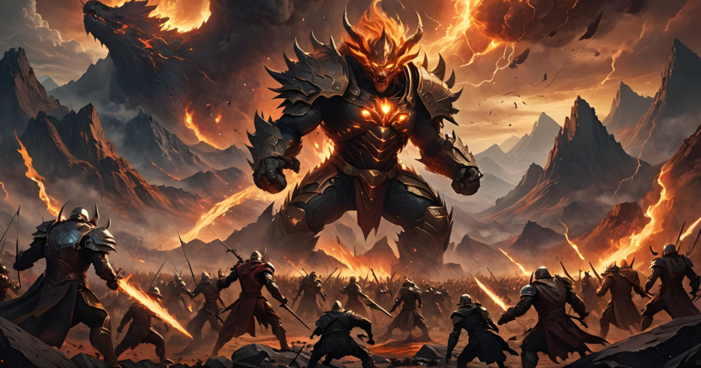

# About ########################################################################

|                      The Cruel and Lost World of Stonia                      |
| :--------------------------------------------------------------------------: |
|      |

Welcome to [Erich Erstu's](https://ericherstu.net/ "Erich's personal web page")
fan page of Stonia!

Stonia is the first Estonian multi user dungeon ([MUD][ref-00]).

On this page you will find [area maps](#Maps), [fast travel paths](#Paths) and
other informative materials that may come handy to a dedicated Stonist.

If you are completely new to Stonia, then it is recommended to start from the
[Intro section](#Intro).

# Intro ########################################################################

Stonia is a text based role-playing game where multiple users can have a shared
adventure together. The players are supposed to either cooperate or kill each
other as these actions are an integral part of the game.

If you are interested in seeing how the game looks like, then play the following
screen recording. The video shows a short game session of a ghost mage who tests
out some of his magic spells on low level non-player characters (NPCs). This
screen recording also features some basic sound effects that have been added to
the game with the help of a custom MUD client.

|                                                                              |
| :--------------------------------------------------------------------------: |
|                                                                              |
|                   [![Screenshot][img-stonia]][vid-stonia]                    |
|                                                                              |
|             a screen recording of a short game session in Stonia             |

[img-stonia]: https://img.youtube.com/vi/I9ZEksNwBio/sd1.jpg
[vid-stonia]: https://www.youtube.com/watch?v=I9ZEksNwBio
              "Screen recording showing off Stonia MUD"

If you are on Linux and you would now like to try out Stonia yourself, then open
the command line terminal and simply type `telnet stonia.ttu.ee 4000`. That
should connect you to the Stonia MUD server.

If you are on Windows, then you should probably enable the Telnet client first.
For that, open the _Control Panel_, go to _Programs_ and select _Enable or
disable Windows features_. In the list of features, search for and select
_Telnet Client_. Confirm the operation by clicking _OK_ and follow the on-screen
instructions to complete the installation. After that open command console and
type `telnet stonia.ttu.ee 4000`.

Alternatively, you may download a special purpose MUD client such as the
[Jaba MUD Client][ref-01]. It allows you to specify hotkeys for certain commands
and much more. Playing with such a client is recommended because it makes the
game easier.

After playing some time you may experience something spectacular. Perhaps you
would like to share your story with others? One way to do this is to copy-paste
your MUD log onto a plaintext file and upload it to the
[Logstation of Stonia][ref-02]. Since others do the same, players get to see
and comment each other's adventures.

# Atlas ########################################################################

## Maps ########################################################################

### Coliseum ###################################################################

|              |                                                               |
| -----------: | :-----------------------------------------------------------: |
|              |             ![Map of Coliseum][img-map-coliseum]              |
|              |       Map of [Coliseum][txt-map-coliseum], February 2004      |
| Area·file:   | thiefsforest.are                                              |
| Memberland→  | dnd4e14ne5ne2nen2en4en2e                                      |
|              | open hidden door                                              |
|              | 2de2s2eueu2es3enunw                                           |

[img-map-coliseum]: ./files/maps/coliseum.webp "map of Coliseum"
[txt-map-coliseum]: ./files/maps/coliseum.txt "ASCII map of Coliseum"

### Dorpat #####################################################################

|              |                                                               |
| -----------: | :-----------------------------------------------------------: |
|              |               ![Map of Dorpat][img-map-dorpat]                |
|              |         Map of [Dorpat][txt-map-dorpat], January 2006         |
| Area·file:   | dorpat.are                                                    |

[img-map-dorpat]: ./files/maps/dorpat.webp "map of Dorpat"
[txt-map-dorpat]: ./files/maps/dorpat.txt "ASCII map of Dorpat"

### Dwarven Kingdom ############################################################

|              |                                                               |
| -----------: | :-----------------------------------------------------------: |
|              |       ![Map of Dwarven Kingdom][img-map-dwarvenkingdom]       |
|              | Map of [Dwarven Kingdom][txt-map-dwarvenkingdom], January 2006|
| Area·file:   | dwarvenkingdom.are                                            |

[img-map-dwarvenkingdom]: ./files/maps/dwarvenkingdom.webp
                          "map of Dwarven Kingdom"
[txt-map-dwarvenkingdom]: ./files/maps/dwarvenkingdom.txt
                          "ASCII map of Dwarven Kingdom"

### Grey Mountains #############################################################

|              |                                                               |
| -----------: | :-----------------------------------------------------------: |
|              |       ![Map of Grey Mountains][img-map-greymountains]         |
|              |   Map of [Grey Mountains][txt-map-greymountains], April 2004  |
| Area·file:   | greymountains.are                                             |

[img-map-greymountains]: ./files/maps/greymountains.webp "map of Grey Mountains"
[txt-map-greymountains]: ./files/maps/greymountains.txt
                         "ASCII map of Grey Mountains"

### Hobgoblin Kingdom ##########################################################

|              |                                                               |
| -----------: | :-----------------------------------------------------------: |
|              |        ![Map of Hobgoblin Kingdom][img-map-hobgoblins]        |
|              | Map of [Hobgoblin Kingdom][txt-map-hobgoblins], February 2004 |
| Area·file:   | gnomevillage.are                                              |

[img-map-hobgoblins]: ./files/maps/hobgoblins.webp "map of Hobgoblin Kingdom"
[txt-map-hobgoblins]: ./files/maps/hobgoblins.txt
                      "ASCII map of Hobgoblin Kingdom"

### Jeddyland ##################################################################

|              |                                                               |
| -----------: | :-----------------------------------------------------------: |
|              |             ![Map of Jeddyland][img-map-jeddyland]            |
|              |      Map of [Jeddyland][txt-map-jeddyland], February 2004     |
| Area·file:   | jeddyland.are                                                 |

[img-map-jeddyland]: ./files/maps/jeddyland.webp "map of Jeddyland"
[txt-map-jeddyland]: ./files/maps/jeddyland.txt "ASCII map of Jeddyland"

### Lindanise ##################################################################

|              |                                                               |
| -----------: | :-----------------------------------------------------------: |
|              |       ![Map of Northern Lindanise][img-map-n-lindanise]       |
|              |Map of [Northern Lindanise][txt-map-n-lindanise], January 2006 |
|              |       ![Map of Southern Lindanise][img-map-s-lindanise]       |
|              |Map of [Southern Lindanise][txt-map-s-lindanise], January 2006 |
| Area·file:   | lindanise.are                                                 |

[img-map-n-lindanise]: ./files/maps/n-lindanise.webp "map of Northern Lindanise"
[img-map-s-lindanise]: ./files/maps/s-lindanise.webp "map of Southern Lindanise"
[txt-map-n-lindanise]: ./files/maps/n-lindanise.txt
                       "ASCII map of Northern Lindanise"
[txt-map-s-lindanise]: ./files/maps/s-lindanise.txt
                       "ASCII map of Southern Lindanise"

## Paths #######################################################################

| Source → Destination     | Fast Travel Path                                  |
| -----------------------: | :-----------------------------------------------: |
|Large·Cave→EOP            | 2en2uenw2n2e3swuenes2e5s                          |
|EOP→Large·Cave            | 3n2wnwswde3n2w2sesw2ds2w                          |
|EOP→Hermit                | 8s2e3sw2sw3s2e3sw3s2wsw                           |
|Hermit→EOP                | en2e3ne3n2w3ne2nen3wnwnene7n                      |
|Hermit→Khan               | es2w2sw2nw2n4w2swuw2n3u2nd2ndndwnwn               |
|Hermit→Split              | es2w2sw2nw2n4w2swu2w5dwn2w3ses                    |
|Dorpat bridge→Split       | d5wsw2nws4wn3wn2wn3w2n3wn4w3n4ws5wn10ws3ws2wn4w   |
|Split→Dorpat·bridge       | 4es2en3en10es5en4e3s4es3e2s3es2es3es4ene2sen4eu   |
|Split→Dorpat·W-gate       | 4es2en3en10es5en4e3s4es3e2s3es2es3es4enenwn3wn2w3n|
|                          | e2nes2es4e2s2esws2ws                              |
|Dorpat·W-gate→Split       | n2enen2w2n4wn2wnw2sw3s2es3esesws4wn3wn2wn3w2n3wn4w|
|                          | 3n4ws5wn10ws3ws2wn4w                              |
|Split→Hobgoblin           | 4es2en3en10es5en4e3s4es3e2s3es2es3es4enenwn3wn2w3n|
|                          | e2nes2es4e2s2esws2ws6ws3wn13w2s3wn3w2n2w2n        |
|Hobgoblin→Dorpat·W-gate   | 2s2e2s3es3e2n13es3en6e                            |
|Dorpat·W-gate→Hobgoblin   | 8ws3wn13w2s3wn3w2n2w2ne                           |
|Split→Mahn·Tor            | 5s2wsu5swse3sd9s2u                                |
|Mahn·Tor→Split            | 2d9nu3nwne5ndn2e5n                                |
|Dorpat·W-gate→Goblinville | 8ws3wn13w2s3wn3w2n2wn4w                           |
|Split→Solea               | 4se2ues5e3s                                       |
|Split→Jedyland            | 4se2uese5sws                                      |
|Memberland→Coliseum       | dnd4e14ne5ne2nen2en4en2e (open hidden door)       |
|                          | 2de2s2eueu2es3enunw                               |
|Reaper→High·Tower         | n2u2e2n2ded2w2d2e2d10w5n2ene3n2wn3wnwn4e2nen      |
|Dorpat·N-gate→Ofcol       | 4n3w3nw2nwn2wn4wnwnwnn8en4e                       |
|Dorpat·N-gate→Spider      | 4n3w3n6wn2wn3wn3wnws                              |
|Crypt→Dorpat              | eue2uw2u2ene3d                                    |
|Sneezing·Cloud→Witch·tower| 2eswuneu                                          |
|Crypt→Gredhon             | eueuneddsdennwwwssendneds                         |
|Dorpat·N-gate→HT          | 4n3w3nwn3w3nw2nwn6wn2wn2wn3wnwnenenene2nen        |
|Crypt→amethyst            | eueu8nwsw4swswdw2n5wnw2dws2wsu4ses4es3es5e        |
|Main·tent→Dorpat          | 2s2w5n                                            |
|TN→Dorpat                 | nw2sd9es6e2s2enes4es3e2s3es2es3es4ene2sen4eu      |
|TN→Memberland             | nw6n2e8n5e2ne                                     |
|TN→Gravedigger            | nw6n2e6n2wds4w2s (two-handed sword)               |
|TN→Bard                   | nw6s2e9s6wsw2sw3sw6s2esesdwsws3w                  |
|Split→Bard                | 4se2ues6e2sue3nen3w (rune-covered knife)          |
|TN→Swamp                  | nw2sdws3ws2wn4w (Split) 5s7w2nws                  |
|TN→Polar·bears            | nw2sdws3ws2wn4w (Split) 5s7ws2w3s                 |
|TN→Old·Thalos             | nw6s2e9s6wsw2sw3sw6s3w (two-handed sword)         |
|EOP→Iron·knuckles         | s3wn2w2n2w11n10e7dsw4sese                         |
|TN→Ghosts                 | nw6s2e9s6wsw2sw3sw6s2esesd8s                      |
|Crypt→Dorpat              | eue2uw2u2ene3d                                    |
|Split→Ghosts              | 4se2ues6e2sue3ne2nene8s                           |
|Crypt→Holy·Grove          | eueu8nen3e3s                                      |
|TN→Draconians             | nw2sd3ws2wn4w5s2wsu5swse3sdsu                     |
|TN→Thief's·forest         | nw6n2e8n5e2n6endnd4e14n5ne2nen2en4en2e            |
|Hermit's·hut→Memberland   | e2n6e2n                                           |
|EOP→British·Fort          | 2sesededed8s6es2e2ses2esue2n                      |
|Hermit's·hut→Baldor       | e2ne8ndw                                          |
|Hermit's·hut→Khanlandria  | es2w2sw2nw2n4w2swuw2n3u2nd2ndndwnwn               |
|Split→Goblins             | nws5wnw                                           |
|Split→Drows               | nws4wn2end                                        |
|Split→Swamp               | 5s7w2nws                                          |
|Split→Solea               | 4se2ues5e3s                                       |
|Split→Minotaurs           | 5s2wsu5swse3sd4s                                  |
|Hermit's·hut→Shire        | 2en6e4s5e3sw5sw3sw3s8es6es12es                    |
|Gnome·Village→Gerighelm   | 4es2e2s3es3e2n5es2e2se2n2en2wnw                   |
|Gerighelm's·Gate→Ofcol    | 2n2w4n4eses3es2es2en8en2e                         |
|EOP→Wide·Trail            | 8s2en                                             |
|EOP→Trolls                | s3wn2w2n2wn3w                                     |
|EOP→Moria·Catacombs       | s3wn2w2n2w4s (Moria altar)                        |
|                          | 2en2uesesunw2n2wneseunw2s3e                       |
|Hermit's·hut→Elven·Valley | eswn2w5nd                                         |
|Lindanise·Waterfall→Dorpat| s2es6e2s2enes4es3e2s3es2es3es4ene2sen4eu          |
|Moria·altar→EOP           | 2en2uesesunw2n2wneseun2w5s                        |
|EOP→Hermit's·hut          | 8s2e3sw2sw3s2e2sw3s2w2sw                          |
|Waterfall→Split           | s8ws3ws2wn4w                                      |
|Moria·altar→Gnome·Village | 2en2uesesunw2n2wneseunw2s3e3s2es2e2ds2e4s4esedes8e|
|                          | 3s2d6sd9se5s2wu2se2su6w2s2en2es2e3ses2es2e        |

# Skills #######################################################################

## Languages ###################################################################

| Skill     | Teacher / Room                   | Area                          |
| :-------- | :------------------------------- | :---------------------------- |
| aserton   |                                  |                               |
| roshya    | Masters cave                     | Moria                         |
| brontesh  |                                  |                               |
| saindsell |                                  |                               |
| stalfet   | Druidess                         | Holy grove                    |

## Magic Items #################################################################

| Skill     | Teacher / Room                   | Area                          |
| :-------- | :------------------------------- | :---------------------------- |
| scrolls   | the Librarian                    | High Tower                    |
| staves    | Talemon                          | Elven Valley                  |
| wands     | Talemon                          | Elven Valley                  |

## Combat ######################################################################

| Skill           | Teacher / Room                   | Area                    |
| :-------------- | :------------------------------- | :---------------------- |
| backstab        | a rogue                          | Gypsy Village           |
|                 | Human Ranger                     | Earthsea                |
|                 | the orkish assassin              | Barad-Dur               |
| bash            | Dwarven's Guild                  | Dwarven Kingdom         |
|                 | Warriors Guild                   | Dorpat                  |
|                 | The orkish chieftain             | Moria                   |
|                 | The Tournament and Practice Yard | Lindanise               |
| berserk         | the weapons master               | Drow                    |
| dirt kicking    | Geoffrey the fighter             | British Fort            |
| disarm          | Lord Simon                       | The British Valley      |
| disarm light    | Lord Simon                       | The British Valley      |
|                 | Reaper                           | Crypt                   |
|                 | The orkish chieftain             | Moria                   |
| dodge           | Dorgar                           | Mahn-Tor                |
|                 | Eredhol                          | Elven Valley            |
|                 | Thief's guildmaster              | Dorpat                  |
|                 | Masters cave                     | Moria                   |
|                 | Thief's Guildmaster              | Lindanise               |
| enhanced damage | Colonel                          | Lindanise               |
|                 | Grond                            | Grey Mountains          |
|                 | Orcish Chieftain                 | Moria                   |
| fast healing    | A ghost of Ralf-I                | Ghost town              |
|                 | an old orc                       | Moria                   |
|                 | the high priest                  | Dorpat                  |
| hand to hand    | Ogre chieftain                   | Ogre Village            |
|                 | Golem                            | Molodir's Curse         |
| kick            | Warrior Guild                    | Dorpat                  |
|                 | Dwarven's Guild                  | Dwarven                 |
|                 | The Tournament and Practice Yard | Lindanise               |
|                 | Eredhol the Valley Chieftain     | Elven Kingdom           |
| knockout        | Colonel                          | Lindanise               |
|                 | Grond                            | Grey Mountains          |
| parry           | Warriors Guild                   | Dorpat                  |
|                 | Grond                            | Grey mountains          |
|                 | Dwarven's Guild                  | Dwarven                 |
|                 | The Tournament and Practice Yard | Lindanise               |
| rescue          | Colonel                          | Lindanise               |
|                 | Grond                            | Grey Mountains          |
| second attack   | Warriors Guild                   | Dorpat                  |
|                 | Dwarven's Guild                  | Dwarven                 |
|                 | The Tournament and Practice Yard | Lindanise               |
| shield block    | Eredhol                          | Elven                   |
|                 | Grond                            | Grey Mountains          |
|                 | Masters cave                     | Moria                   |
|                 | Dwarven's Guild                  | Dwarven                 |
|                 | Warriors Guild                   | Dorpat                  |
|                 | The Tournament and Practice Yard | Lindanise               |
| third attack    | Colonel                          | Lindanise               |
|                 | The orkish chieftain             | Moria                   |
| trip            | Dorgar                           | Mahn-Tor                |

## Weapons #####################################################################

| Skill     | Teacher / Room                   | Area                          |
| :-------- | :------------------------------- | :---------------------------- |
| axe       | Mahn-Tor                         | Mahn-Tor                      |
|           | the stocky dwarven warrior       | Khanlandria                   |
| dagger    | Thief's Guildmaster              | Dorpat                        |
|           | Masters cave                     | Moria                         |
|           | Thief's Guildmaster              | Lindanise                     |
|           | the spirit of King Crotus        | Chapel Catacombs              |
| flail     | Tolgar the Halforc               | Elven Palace                  |
| mace      | Sultan                           | Dorpat                        |
|           | Masters cave                     | Moria                         |
|           | Titan's Lord                     | Titan's Stronghold            |
|           | the spirit of King Crotus        | Chapel Catacombs              |
| polearm   | The Mage's Laboratory            | Dorpat                        |
|           | Reaper                           | Crypt                         |
| spear     | Zurmos                           | Ofcol                         |
| sword     | Masters cave                     | Moria                         |
|           | Dwarven's Guild                  | Dwarven Kingdom               |
|           | Warriors Guild                   | Dorpat                        |
|           | the spirit of King Crotus        | Chapel Catacombs              |

## Other #######################################################################

| Skill           | Teacher / Room                   | Area                    |
| :-------------- | :------------------------------- | :---------------------- |
| bash door       | Storekeeper                      | Dwarven                 |
|                 | The orkish chieftain             | Moria                   |
|                 | a guildmaster / Cosy cave        | Grey Mountains          |
| climb           | Storekeeper                      | Dwarven Kingdom         |
|                 | Masters cave                     | Moria                   |
|                 | a guildmaster / Cosy cave        | Grey Mountains          |
| command         | the nomads commander             | Sands of Sorrow         |
|                 | Foreman                          | Dorpat                  |
| compare         | a baker                          | Lindanise               |
| cook            | Farmer Gamgee                    | Solea                   |
|                 | a granite head                   | Dwarven Kingdom         |
| find familiar   | the pet shop boy                 | Lindanise               |
| haggle          | trader                           | Moria                   |
|                 | the beggar                       | Britsh Valley           |
|                 | a dwarven merchant               | Khanlardin              |
|                 | Kareem                           | Dorpat                  |
| hide            | Dorgar                           | Mahn-Tor                |
| hide self       | Dorgar                           | Mahn-Tor                |
| light fire      | Demon cook                       | Demons Keep             |
|                 | a cook                           | Elven Palace            |
| lore            | the librarian                    | Old Thalos              |
|                 | Elvira                           | Dorpat                  |
| meditation      | Jaana the Druid                  | The British Valley      |
| mend            | the grocer                       | Shire                   |
|                 | Ahkeem                           | Dorpat                  |
|                 | Storekeeper                      | Dwarven Kingdom         |
|                 | The Reaper of the Dead           | Ghost town              |
|                 | Masters cave                     | Moria                   |
|                 | a guildmaster / Cosy cave        | Grey Mountains          |
| peek            | Thief's guildmaster              | Dorpat                  |
|                 | Thief's Guildmaster              | Lindanise               |
| pick lock       | Thief's guildmaster              | Dorpat                  |
|                 | Thief's Guildmaster              | Lindanise               |
| rebuild exit    | a guildmaster / Cosy cave        | Grey Mountains          |
| ride            | Belrak                           | Mahn-Tor                |
| search          | a hunter                         | Jeddyland               |
| sneak           | Thief's Guildmaster              | Dorpat                  |
|                 | Thief's Guildmaster              | Lindanise               |
| steal           | a jeddy thief                    | Jeddyland               |
|                 | Thief's Guildmaster              | Lindanise               |
|                 | Thief's Guildmaster              | Dorpat                  |
| track           | a hunter                         | Jeddyland               |

# Spells #######################################################################

| Spell             | Teacher / Room                    | Area                 |
| :---------------- | :-------------------------------- | :------------------- |
| acid blast        | the drow mistress                 | Drow                 |
|                   | The Grand Mistress                | High Tower           |
| acid breath       | Ancient Gold Dragon               | Ofcol                |
| armor             | Cleric Guild                      | Dorpat               |
|                   | Dwarven Doctor                    | Dwarven Kingdom      |
|                   | Cleric's Guild                    | Elven Valley         |
|                   | Cleric's Sanctum                  | Dorpat               |
|                   | A Priest of the Dead              | Ghost town           |
| bless             | Priestess of Ofcol                | Ofcol                |
|                   | A Priest of the Dead              | Ghost town           |
|                   | Orcish healer                     | Moria                |
|                   | the stone golem                   | Dorpat               |
| blindness         | High Priest of Hell               | Hell                 |
|                   | the spectre                       | Wyvern's Tower       |
| brigh light       | the High Priest                   | Khanlandria          |
| burning hands     | Mage Guildmaster                  | Elven Valley         |
|                   | The Mage's Laboratory             | Dorpat               |
|                   | An old ghost                      | Ghost town           |
| call lightning    | an elven alchemist                | Elven Palace         |
| calm              | Elder                             | Elven Valley         |
|                   | Zurmos                            | Ofcol                |
| cancellation      | Elven Elder                       | Elven Valley         |
|                   | Orcish Healer                     | Moria                |
|                   | A Priest of the Dead              | Ghost town           |
| cause critical    | Rotting Skeleton (Tomb)           | Ghost town           |
|                   | A monumental Church               | Lindanise            |
| cause light       | Rotting Skeleton (Tomb)           | Ghost town           |
|                   | A monumental Church               | Lindanise            |
| cause serious     | Rotting Skeleton (Tomb)           | Ghost town           |
|                   | A monumental Church               | Lindanise            |
| chain lightning   | Orm                               | Earthsea             |
|                   | an elven alchemist                | Elven Palace         |
| change better     | Master of Goodness                | High Tower           |
| change worse      | The master of the black robes     | High Tower           |
| charm person      | Master of charmer                 | Hight Tower          |
| chill touch       | Mage's Guild                      | Elven Valley         |
|                   | The Mage's Laboratory             | Dorpat               |
|                   | An old ghost                      | Ghost town           |
| cold              | ice devil                         | Hell                 |
| colour spray      | Old wizard                        | Old Thalos           |
| continual light   | Granite Head                      | Dwarven              |
|                   | Mage's Guild                      | Elven Valley         |
|                   | The Mage's Laboratory             | Dorpat               |
|                   | Reaper                            | Ghost town           |
| control weather   | an elder druidess                 | Holy Grove           |
| create food       | Dwarven Doctor                    | Dwarven              |
|                   | Cleric's Guild                    | Elven Valley         |
|                   | An old ghost                      | Ghost town           |
|                   | A lich                            | Ghost town           |
| create spring     | Cleric's Guild                    | Elven Valley         |
|                   | An old ghost                      | Ghost town           |
| create water      | Dwarven Doctor                    | Dwarven Kingdom      |
|                   | Cleric's Guild                    | Elven Valley         |
|                   | An old ghost                      | Ghost town           |
| create weapon     | An old ghost                      | Ghost town           |
|                   | A wandering wizard                | High Tower           |
| cure blindness    | Cleric's Guild                    | Elven Valley         |
|                   | A monumental Church               | Lindanise            |
|                   | A Priest of the Dead              | Ghost town           |
| cure critical     | A monumental Church               | Lindanise            |
|                   | Cleric's Guild                    | Elven Valley         |
|                   | Dwarven Doctor                    | Dwarven Kingdom      |
|                   | Cleric's Sanctum                  | Dorpat               |
|                   | A Priest of the Dead              | Ghost town           |
| cure disease      | the priest of Thalos              | Old Thalos           |
| cure light        | Dwarven Doctor                    | Dwarven              |
|                   | Cleric's Guild                    | Elven Valley         |
|                   | Cleric's Sanctum                  | Dorpat               |
|                   | A monumental Church               | Lindanise            |
|                   | A Priest of the Dead              | Ghost town           |
| cure poison       | the priest of Thalos              | Old Thalos           |
|                   | orcish healer                     | Moria                |
|                   | A monumental Church               | Lindanise            |
| cure serious      | Dwarfev Doctor                    | Dwarven Kingdom      |
|                   | Cleric's Guild                    | Elven Valley         |
|                   | Cleric's Sanctum                  | Dorpat               |
|                   | A monumental Church               | Lindanise            |
|                   | A Priest of the Dead              | Ghost town           |
| curse             | the High priest of Hell           | Hell                 |
|                   | dark-knight                       | Demon's Keep         |
| demonfire         | seth's priest                     | Temple of Seth       |
| detect evil       | Master of Neutrality              | High Tower           |
| detect hidden     | the wizard                        | Lindanise            |
| detect invis      | the wizard                        | Lindanise            |
| detect magic      | master of illusions               | High Tower           |
| detect poison     | a young scholar                   | Old Thalos           |
| dispel evil       | Ulma                              | Baldor               |
| dispel good       | Shaman                            | Baldor               |
| dispel magic      | an elven mage                     | Elven Palace         |
| earthquake        | Nasturn                           | Mahn-Tor             |
| enchant armor     | the Enchanter                     | High Tower           |
| enchant weapon    | the Enchanter                     | High Tower           |
| energy drain      | Vampire Lord                      | Ghost town           |
| engender spirit   | Mage's guildmaster                | Lindanise            |
| enlarge size      | an aged wizard                    | High Tower           |
| faerie fire       | spell blinder                     | High Tower           |
| faerie fog        | spell blinder                     | High Tower           |
| fire breath       | the Great Red Dragon              | Dragon Tower         |
| fireball          | Gandalf                           | Shire                |
| flamestrike       | Fire Demon                        | Hell                 |
| fly               | guardian of Bifost                | Heimdall             |
| frenzy            | the Mad Alchemis                  | High Tower           |
| frost breath      | the Great White Dragon            | Dragon Tower         |
| gas breath        | the Ancient Green Dragon          | Dragon Tower         |
| giant strength    | a powerful mage                   | Dragon Tower         |
| harm              | Shaman                            | Baldor               |
|                   | Ulma                              | Baldor               |
| haste             | the battle mistress               | High Tower           |
| heal              | a healer                          | Jeddyland            |
| holy word         | The Grand Mistress                | High Tower           |
| identify          | the librarian                     | Old Thalos           |
| infravision       | a spell teacher                   | High Tower           |
| invis             | Tatorius                          | High Tower           |
| know alignment    | The master of Neutrality          | High Tower           |
| lightning bolt    | Gandalf                           | Shire                |
| lightning breath  | Ancient Wyrm                      | Titan's Stronghold   |
| locate life       | Magnus wizard                     | Solea                |
| locate object     | Magnus wizard                     | Solea                |
| magic missile     | Mage's Guild                      | Elven Valley         |
|                   | The Mage's Laboratory             | Dorpat               |
|                   | An old ghost                      | Ghost town           |
| mass healing      | The Eremite                       | Coloseum             |
| mass invis        | Tatorious                         | High Tower           |
| pass door         | a druid the ugly                  | Old Thalos           |
| plague            | wicker witch                      | Witche's Tower       |
| poison            | elder druid                       | Spider               |
| protection evil   | Priestess of Ofcol                | Ofcol                |
| reduce size       | an aged wizard                    | High Tower           |
| refresh           | an elder druid                    | Holy Grove           |
| remove curse      | the city druid                    | The British Valley   |
| reshape body      | The Grand Mistress                | High Tower           |
| sanctuary         | The Eremite                       | Colosseum            |
| shield            | sorbus the Hermit                 | Hermit's Hut         |
| shocking grasp    | Mage's Guild                      | Elven Valley         |
|                   | The Mage's Laboratory             | Dorpat               |
|                   | An old ghost                      | Ghost town           |
| sleep             | the drow mage noble               | Drow                 |
|                   | Seth's priest                     | Temple of Seth       |
| stone skin        | Aruncus the Druid                 | Hermit's Hut         |
| summon            | the master summoner               | High Tower           |
| teleport a wizard | Teleport                          | High Tower           |
| ventriloquate     | an old wizard                     | Old Thalos           |
| weaken            | an ugly witch                     | High Tower           |
| word of recall    | old wizard                        | Baldor               |

# Links ########################################################################

As in the good old times when people first started making personal websites for
themselves, the tail of this site is composed of a list of domains that we wish
to share with the world wide web.

## Community ###################################################################

* [Logstation](https://stonia.net.ee/logstation/) —
  upload and comment Stonia gameplay logs
* [Stonia.ttu.ee](http://stonia.ttu.ee/) —
  official website of Stonia
* [Ranka.ee/stonia](https://ranka.ee/stonia/) —
  Ranka's fansite of Stonia

## Software ####################################################################

* [Jaba MUD Client][ref-01] —
  recommended MUD client for playing Stonia

[ref-00]: https://en.wikipedia.org/wiki/Multi-user_dungeon
         "Wikipedia article about Multi User Dungeons"
[ref-01]: https://ranka.ee/stonia/jmc-download-jaba-mud-clienti-alla-laadimine/
         "download JMC"
[ref-02]: https://stonia.net.ee/logstation/
         "logstation of Stonia"
